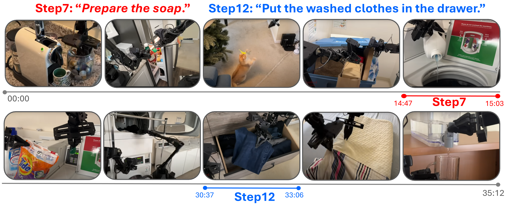
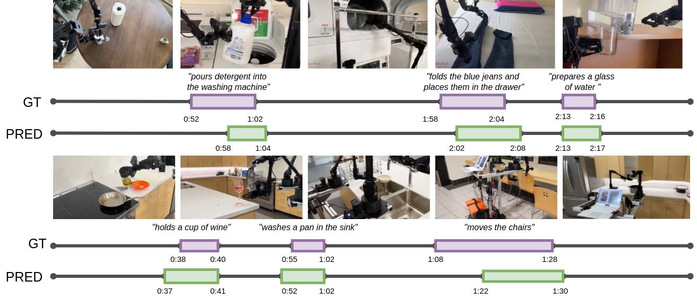

<h1 align="center">BayesianVSLNet - Temporal Video Segmentation with Natural Language using Text-Video Cross Attention and Bayesian Order-priors</h1>


<div align="center">
    
</div>

 <div align="center">
    <a href="https://cplou99.github.io/web/" target="_blank">Carlos Plou*</a>,
    <a href="https://sites.google.com/unizar.es/lorenzo-mur-labadia/inicio" target="_blank">Lorenzo Mur-Labadia*</a>,
    <a href="https://webdiis.unizar.es/~jguerrer/" target="_blank">Jose J. Guerrero</a>,
    <a href="https://webdiis.unizar.es/~rmcantin/" target="_blank">Ruben Martinez-Cantin</a>,
    <a href="https://sites.google.com/unizar.es/anac/home?authuser=0" target="_blank">Ana C. Murillo</a>,
</div>


<div align="center">
   <a href="https://cplou99.github.io/BayesianVSLNet"><strong>🌍 Homepage</strong></a> | <a href="docs/img/poster.png"><strong> 🪧 Poster</strong></a> |  <a href="https://arxiv.org/abs/2406.09575"><strong>📝 Challenge Report </strong></a> | <a href=""><strong>📄 Paper (soon)</strong></a>
   </div>   
      


## 🔔 News:
- :soon:: Paper with an improved BayesianVSLNet++ version together with checkpoints and pre-extracted video features.
- 🔥 7/15/2024: Code released!
- 😎 6/15/2024: [Poster](docs/img/poster.png) presentation at EgoVis Workshop during CVPR2024.
- 🥳 6/10/2024: [Challenge report](https://arxiv.org/abs/2406.09575) is available on ArXiv!
- :trophy: 6/01/2024: BayesianVSLNet wins the Ego4D Step Grounding Challenge CVPR24.


## BayesianVSLNet
We build our approach BayesianVSLNet: Bayesian temporal-order priors for test time refinement. Our model significantly improves upon traditional models by incorporating a novel Bayesian temporal-order prior during inference, which adjusts for cyclic and repetitive actions within video, enhancing the accuracy of moment predictions. 


## Quick start

### Install dependencies

```ruby
git clone https://github.com/cplou99/BayesianVSLNet
cd BayesianVSLNet
pip install -r requirements.txt
```

### Video Features
We use both Omnivore-L, EgoVideo and EgoVLPv2 video features. They should be pre-extracted and located at ./ego4d-goalstep/step-grounding/data/features/.

### Model 
It is necessary to locate the EgoVLPv2 weights to extract text features ./NaQ/VSLNet_Bayesian/model/EgoVLP_weights.

#### Train
```ruby
cd ego4d-goalstep/step_grounding/
bash train_Bayesian.sh experiments/
```

####  Inference
```ruby
cd ego4d-goalstep/step_grounding/
bash infer_Bayesian.sh experiments/
```


## Results

### Ego4D Step Grounding Challenge
The challenge is built over [Ego4d-GoalStep](https://github.com/facebookresearch/ego4d-goalstep?tab=readme-ov-file) dataset and code.

**Goal:** Given an untrimmed egocentric video, identify the temporal action segment corresponding to a natural language description of the step. Specifically, predict the (start_time, end_time) for a given keystep description.
 
 <div align="center">
 
</div>

You will find in the [leaderboard](https://eval.ai/web/challenges/challenge-page/2188/leaderboard/5405) :rocket: the results in the test set for the best approaches. Our method is currently in the first place :rocket::fire:.

### Case study: Robotics
We present qualitative results in a [real-world assistive robotics scenario](https://mobile-aloha.github.io/) to demonstrate the potential of our approach in enhancing human-robot interaction in practical applications.

 <div align="center">
 
</div>


## 📝 Citation
```
@misc{plou2024carlorego4dstep,
      title={CARLOR @ Ego4D Step Grounding Challenge: Bayesian temporal-order priors for test time refinement}, 
      author={Carlos Plou and Lorenzo Mur-Labadia and Ruben Martinez-Cantin and Ana C. Murillo},
      year={2024},
      eprint={2406.09575},
      archivePrefix={arXiv},
      primaryClass={cs.CV},
      url={https://arxiv.org/abs/2406.09575}, 
}
```
